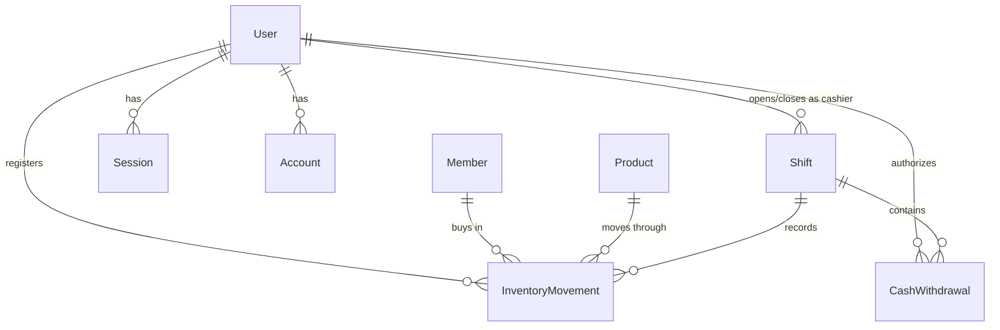

# SGF — Sistema de Gestión Financiera (Financial Management System)

## Description

SGF is a full-stack financial management system that runs the daily operation of a gym: membership registration and renewal, product catalog and two-location inventory (warehouse / gym floor), point-of-sale, cash-register shift cycles with withdrawals and closing summaries, operational reports, and employee/user administration. It also carries a dedicated migration subsystem that ingests historical spreadsheets and rebuilds the operational database from them.

The system is built around a strict layered architecture governed by a formal Architectural Constitution, which defines the responsibilities, contracts, and constraints of each layer. The goal is not only functional correctness but long-term maintainability, predictable data flow, and an explicit, enforceable separation of concerns.

This repository is intended to demonstrate disciplined software design in a real-world context — not a proof of concept, but a system built to survive change.

---

## Architectural Principles

The architecture is organized around eight core principles, each of which maps to a concrete set of enforceable rules:

- **P-1 — Unidirectional Dependencies**: Dependencies flow in one direction only. Inner layers are never aware of outer layers.
- **P-2 — Centralized Orchestration**: Each use case is coordinated by exactly one Service. No orchestration logic lives in the HTTP boundary or in the presentation layer.
- **P-3 — Pure Domain**: The domain layer has zero dependencies on infrastructure, HTTP, or persistence. It contains only business logic, expressed as pure functions.
- **P-4 — Explicit Contracts**: Each layer boundary is defined by an explicit contract (Zod schemas, TypeScript types). Implicit coupling is a violation.
- **P-5 — Use Case-Oriented Design**: Services model business use cases ("register member", "close shift with summary"), not CRUD operations.
- **P-6 — Structural Symmetry**: Contexts are structured consistently across the codebase. A developer familiar with one context should be immediately oriented in any other.
- **P-7 — UI Without Business Logic**: Presentation components receive data and callbacks as props. They do not query APIs, evaluate business rules, or own business state.
- **P-8 — Single Use Case Authority**: Every use case has exactly one canonical Service. If a use case is needed in multiple contexts, the non-owning context calls the owning Service — it never reimplements it.

Violations of these principles constitute active architectural debt. Exceptions require an approved Architecture Decision Record (ADR) before the change is integrated.

---

## Project Structure

```
/
├── app/
│   ├── (dashboard)/[context]/    # Server pages + per-page component trees
│   │   ├── page.tsx              # Fetches initial data server-side, passes to Manager
│   │   └── _components/          # [Context]Manager + all presentational components
│   ├── api/[context]/route.ts    # Validates input via types/api, calls one Service, returns response
│   └── generated/prisma/         # Generated Prisma Client (custom output path)
│
├── modules/                # Canonical home for domain logic (actively migrated to)
│   ├── members/ products/ inventory/ sales/ users/ migration/
│   └── [context]/
│       ├── *.service.ts    # Use-case functions (async, touches Prisma)
│       ├── types.ts        # Module-level types
│       └── domain/         # Pure functions: filters, payloads, formatters, calculations
│
├── services/               # Legacy use-case layer for shifts + reports — being migrated
│   ├── shifts.service.ts   # Shift lifecycle, withdrawals, summaries, statistics
│   ├── reports.service.ts  # Sales/stock reports, dashboard summary
│   └── index.ts            # Re-exports all services (both old and new module locations)
│
├── lib/
│   ├── domain/              # Legacy domain logic (sales, shifts, reports, shared)
│   ├── api/                 # Client-side fetch wrappers — called ONLY from Manager components
│   ├── auth.ts               # better-auth instance (email + password, Prisma adapter)
│   ├── db.ts                 # Prisma singleton (legacy contexts)
│   └── require-role.ts       # Server-side role guard
│
├── types/
│   ├── api/                 # HTTP contract layer — Zod schemas and inferred TypeScript types
│   └── models/               # Domain model types (Socio, Producto, Corte, etc.)
│
└── components/
    ├── ui/                   # shadcn/ui primitives
    └── layout/               # Sidebar, Header, ThemeToggle
```

Each context follows the same internal structure. Deviations from this layout are considered structural violations.

---

## Functional Domains

Every domain maps to one dashboard route, one HTTP surface under `app/api/`, and one owning Service. This table is the shortest path from "what does the system do" to "where is that code".

| Domain | Route | HTTP surface | Owning Service |
| ------ | ----- | ------------ | -------------- |
| **Members** — registration, renewal, validity windows, expired-member tracking | `/socios` | `api/members` | `modules/members/members.service.ts` |
| **Products** — catalog, pricing, activation | `/productos` | `api/products` | `modules/products/products.service.ts` |
| **Inventory** — entries, adjustments, warehouse↔gym transfers, kardex, cancellations | `/inventario` | `api/inventory` | `modules/inventory/inventory.service.ts` |
| **Sales** — point of sale, ticket lookup | `/ventas` | `api/sales` | `modules/sales/sales.service.ts` |
| **Sales history** — universe-level stats over paginated results | `/historial-ventas` | `api/sales/history` | `modules/sales/sales.service.ts` |
| **Shifts (cortes)** — open/close cash register, cash withdrawals, closing summary, statistics | `/cortes` | `api/shifts` | `services/shifts.service.ts` *(legacy)* |
| **Reports** — sales by product, daily sales, current stock, dashboard summary | `/reports` | `api/inventory/report` | `services/reports.service.ts` *(legacy)* |
| **Users / employees** — creation, activation, deactivation, admin password reset | `/usuarios` | `api/usuarios` | `modules/users/users.service.ts` |
| **My account** — self-service password change | `/mi-cuenta` | `api/usuarios/[id]/password` | `modules/users/users.service.ts` |
| **Migration** — spreadsheet ingest, sync modes, full Reconstruction | `/configuracion` | `api/migracion` | `modules/migration/*.service.ts` |

### The Migration subsystem

`modules/migration/` is the largest and least conventional context, so it is split across three Services with distinct responsibilities:

- **`migration.service.ts`** — parses and previews Excel workbooks (`exceljs`), then runs *sync modes*: `syncMembers` and the staged `syncShifts` / `finalizeSyncMode` pair. Large workbooks are transported in HTTP batches and accumulated in the `MigrationImportStaging` table, so no single request has to carry the whole file.
- **`reconstruction.service.ts`** — the destructive path. Takes a `pg_dump` backup, then rebuilds the operational database from the historical workbooks: `getReconstructionPreview` → `runDatabaseBackup` → `executeReconstruction` → `validateReconstruction`. Execution is phased and reports `failedPhase` on abort; product price restoration is a **blocking** phase when products are reimported, so a partial rebuild can never silently leave prices at zero.
- **`employee-lifecycle.service.ts`** — reconciles the employee roster against the historical data: creates historical employees found in the workbooks, computes deletion candidates, and removes the selected ones.

### Data Model



`InventoryMovement` is the single append-only ledger behind both inventory and sales — a sale, an adjustment, a warehouse entry, and a transfer are all rows of the same table, discriminated by `InventoryType` (`SALE`, `ADJUSTMENT`, `WAREHOUSE_ENTRY`, `GYM_ENTRY`, `TRANSFER_TO_GYM`, `TRANSFER_TO_WAREHOUSE`) and located by `Location` (`WAREHOUSE`, `GYM`). Movements are never deleted; they are cancelled (`isCancelled`), which is what makes the kardex and shift summaries reproducible after the fact.

`MigrationImportStaging` is not part of the operational model — it is scratch space for batched spreadsheet imports, claimed atomically per import type and cleared on finalize.

### Authorization

Two roles, `ADMIN` and `EMPLEADO` (`Role` enum). Enforcement is server-side only:

- `lib/require-role.ts` exposes the three guards every protected surface uses: `requireAuth()`, `requireAdmin()` for server pages, and `requireActiveAdminApi()` for API routes — the last one rejects an inactive `ADMIN` as hard as a non-admin, closing the bypass where a deactivated administrator kept privileged access.
- better-auth's admin plugin backs privileged operations (user creation, `setUserPassword`, session revocation).
- Deactivating an employee revokes their sessions in the same transaction — the role check is never the only line of defense.

Client-side role checks exist for UI affordances only and are never trusted as authorization.

---

## Data Flow Overview

### Backend

```
HTTP Request
  → API Route (app/api/[context]/route.ts)
      Validates input via types/api schemas
      Calls exactly one Service method
  → Service (modules/[context]/*.service.ts, or services/*.service.ts for legacy contexts)
      Reads/writes entities via Prisma
      Delegates business logic to domain/
      Returns typed response
  → API Route serializes and returns HTTP response
```

No business logic lives in the route. No Prisma access occurs in the domain. The Service is the sole coordinator.

### Frontend

```
Server Page (app/(dashboard)/[context]/page.tsx)
  Fetches initial data server-side
  Passes data as props to Manager

Manager ([Context]Manager.tsx — "use client")
  Owns all UI state (selected item, open modals, filters, pagination)
  Calls lib/api/*.client.ts for mutations and refreshes
  Imports pure logic from modules/[context]/domain or lib/domain
  Distributes data and callbacks to child components

Presentational Components
  Render received props
  Emit events via callbacks
  Contain no business logic, no API calls, no independent data fetching
```

---

## Architectural Rules — What Is Explicitly Prohibited

The following are hard constraints enforced during code review. They are not style preferences.

- An API route may not contain conditional business logic or access Prisma directly.
- A Service may not import models from another context's Prisma schema directly.
- A Service may not expose Prisma types in its public method signatures.
- A Service method may not reimplement a use case that already exists in another Service.
- A domain function may not import from any infrastructure layer (Prisma, HTTP, environment config).
- A presentational component may not call `lib/api` or own business state.
- A modal component may not fetch its own data — it receives the data it needs as a prop from the Manager.
- A use case may not exist in more than one Service. If two contexts need the same operation, one calls the other.

Rules marked as absolute (NUNCA / NEVER in the constitution) have no exception process. If a situation appears to require breaking them, the issue is with the design of the proposed use case, not with the rule.

---

## Project Status

**In active development.** The system is being progressively aligned with the Architectural Constitution. Some modules may still contain documented violations under remediation. All new code is expected to conform fully. Each exception must be covered by an approved ADR.

The `services/` → `modules/` migration is partial and deliberate — contexts move when they are touched, not on a rewrite sprint:

| Status | Contexts |
| ------ | -------- |
| Migrated to `modules/` | members, products, inventory, sales, users, migration |
| Still in `services/` + `lib/domain/` | shifts, reports (plus the shared helpers in `lib/domain/shared`) |

`services/index.ts` re-exports both locations, so API routes are insulated from where a Service physically lives and a context can move without touching its HTTP boundary.

---

## Technologies Used

| Layer             | Technology                               |
| ----------------- | ---------------------------------------- |
| Framework         | Next.js (App Router)                     |
| Language          | TypeScript                               |
| ORM / Persistence | Prisma with the `@prisma/adapter-pg` driver adapter over PostgreSQL (`pg`); client generated into `app/generated/prisma/` |
| Authentication    | better-auth (email + password, Prisma adapter, admin plugin) |
| Validation        | Zod — also the HTTP contract layer in `types/api/` |
| Forms             | react-hook-form + `@hookform/resolvers` (Zod resolver) |
| Spreadsheet I/O   | exceljs — historical workbook ingest for the migration subsystem |
| Styling           | Tailwind CSS                             |
| UI Components     | React (functional components with hooks), shadcn/ui over Radix primitives, lucide-react icons |
| Test harness      | `tsx` smoke scripts under `scripts/` (see below) |

---

## How to Run

```bash
# Install dependencies
npm install

# Development
npm run dev              # Start Next.js dev server

# Build, lint & serve
npm run build
npm run start            # Serve the production build
npm run lint

# Database (Prisma)
npm run prisma:generate  # Regenerate Prisma client after schema changes
npm run prisma:migrate   # Create and apply a new migration
npm run prisma:push      # Push schema without a migration file (dev only)
npm run prisma:studio    # Open Prisma Studio
npm run prisma:seed      # Seed the database (tsx prisma/seed.ts)
npm run prisma:reset     # Drop and recreate the database + seed
```

`postinstall` runs `prisma generate`, so `npm install` leaves you with a usable client.

Required environment variables (see `.env.example`):

```
DATABASE_URL=
BETTER_AUTH_SECRET=
BETTER_AUTH_URL=
```

---

## Verification — Smoke Tests

There is no unit-test framework. Verification is done with standalone `tsx` scripts under `scripts/`, each one written alongside the change it guards. They talk to the database directly through Prisma — no HTTP server involved — create and clean up their own records, and assert on domain behaviour rather than implementation details. Run `npm run prisma:seed` first: they expect the seeded users and products to exist.

```bash
npm run smoke                        # Main cash-register shift flow (open → sell → withdraw → close)

# Migration subsystem
npm run smoke:parsers                # Workbook parsing (payment methods, membership types)
npm run smoke:inconsistency          # Inconsistency detection in historical data
npm run smoke:member-upsert          # Member upsert idempotency
npm run smoke:shift-sync             # Staged shift sync
npm run smoke:sync-finalize          # Finalize path for staged imports
npm run smoke:migracion-batching     # HTTP batch transport for large workbooks
npm run smoke:employee-lifecycle     # Historical employee creation and deletion candidates
npm run smoke:product-reset          # Product catalog reset during Reconstruction
npm run smoke:product-pricing        # Blocking salePrice restoration
npm run smoke:reconstruction-report  # Reconstruction result reporting

# Reports and statistics
npm run smoke:stock-physical-filter  # Stock report counts physical products only
npm run smoke:shifts-aggregate-stats # Shift stats computed over the full universe
npm run smoke:historial-stats        # Sales-history stats over the full universe
npm run smoke:socios-stats-semantics # isActive vs. validity are independent axes
```

The statistics smoke tests exist because the same class of defect appeared three times: aggregate figures computed over the current page instead of the full result set. Each one pins the universe-level contract for its context.

---

## Final Notes

SGF is an exercise in deliberate software design. The architecture is not incidental — it is the result of a written governing document that predates the implementation decisions it constrains. This means that structural intent is explicit, traceable, and enforceable in code review.

The primary engineering goals are:

- **Predictability**: A developer reading any part of the codebase should be able to reason about it without needing to trace execution across unexpected layer boundaries.
- **Maintainability**: Business logic lives in one place. Changing a rule means changing one module. Changing a use case means changing one Service method.
- **Testability**: The pure domain layer can be tested without mocking databases, HTTP clients, or any infrastructure. Services can be tested with mocked Prisma clients. Components can be tested with static props.

Architecture debt is tracked explicitly. Any deviation from the constitution that cannot be resolved immediately is documented in an ADR, which records what was broken, why, and the conditions under which it should be reverted.

The goal is not a perfect system on day one. It is a system that degrades with intent rather than by accident.

## Portfolio Note

This repository is part of my professional portfolio and showcases
real-world architectural decisions, not a tutorial or template.

## License

MIT License — see LICENSE file for details.
